# System Architecture — Frontend Coach

**Status:** v3 (current)
**Last updated:** 2026-07-02

---

## 1. Overview

Frontend Coach is a Next.js 16 App Router application that helps developers prepare for frontend engineering interviews through four complementary practice modes:

1. **AI Mock Interviews** — adaptive question generation, follow-up probing, rubric-grounded scoring, mock exam mode
2. **Build & Critique** — React component challenges graded by axe-core accessibility audit + AI critique
3. **Question Bank + Study Plan** — 350+ curated questions with spaced-repetition scheduling and daily review
4. **Coding Challenges** — Monaco editor + sandboxed JS execution + AI code review

The entire app deploys as a single Vercel unit backed by Supabase Postgres.

---

## 2. Tech Stack

| Layer | Technology | Notes |
|---|---|---|
| Framework | Next.js 16 (App Router) | RSC streaming, SSE built-in, Turbopack |
| Language | TypeScript (strict) | Zod schemas shared between API and AI contracts |
| Styling | Tailwind v4 + shadcn/ui | CSS variables for light/dark theming |
| AI SDK | Vercel AI SDK v6 | `generateObject` (Zod-validated) + `streamText` |
| LLM Providers | OpenAI, Anthropic, Groq, DeepSeek | Tier-routed via env vars |
| ORM | Prisma 7 | Supabase Postgres with pg adapter |
| Auth | Supabase Auth (`@supabase/ssr`) | Email + Google OAuth; SSR-safe cookie session |
| Rate Limiting | Upstash Redis | Per-user sliding window |
| Payments | Polar | Subscription webhooks |
| Client Cache | TanStack Query v5 | Client-side query cache + optimistic updates |
| Client State | Zustand | Interview session store |
| Code Execution | Node.js `vm` module | Sandboxed JS harness for function challenges |
| Component Sandbox | `<iframe>` srcdoc + Babel CDN | Client-side React render + axe-core a11y audit |
| Code Editor | Monaco (`@monaco-editor/react`) | Lazy-loaded, SSR-disabled |
| Spaced Repetition | SM-2 algorithm | Per-(user, topic) `ReviewItem` rows |
| Hosting | Vercel | Streaming responses, Node runtime |

---

## 3. High-Level Architecture

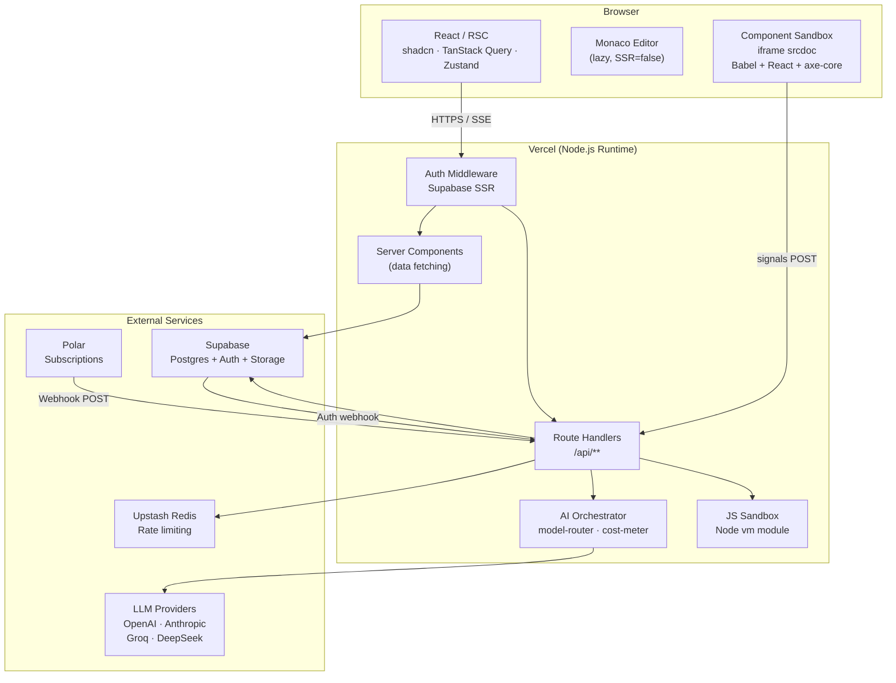

---

## 4. Application Routing

Three Next.js route groups plus root-level public pages:

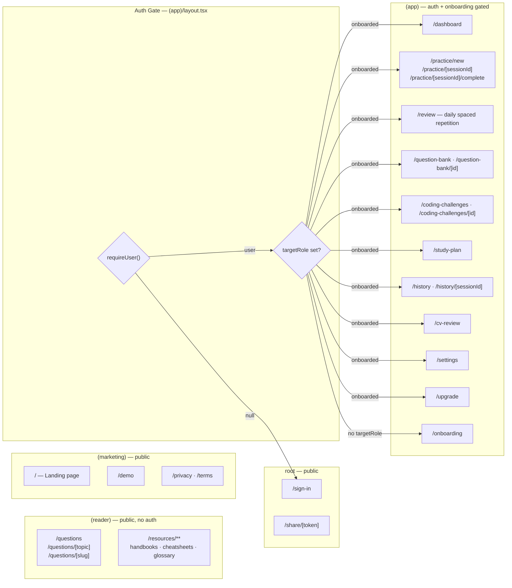

---

## 5. Data Model

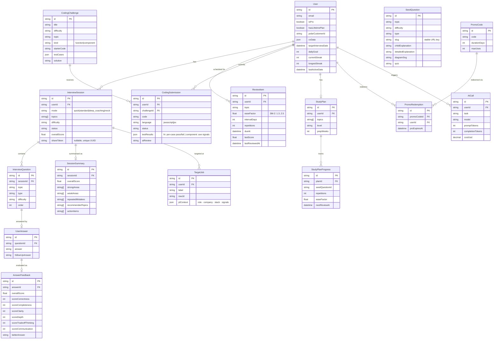

---

## 6. AI Orchestration Layer

Every LLM call routes through `src/lib/ai/orchestrator.ts`. Route handlers stay thin — authenticate, validate, delegate.

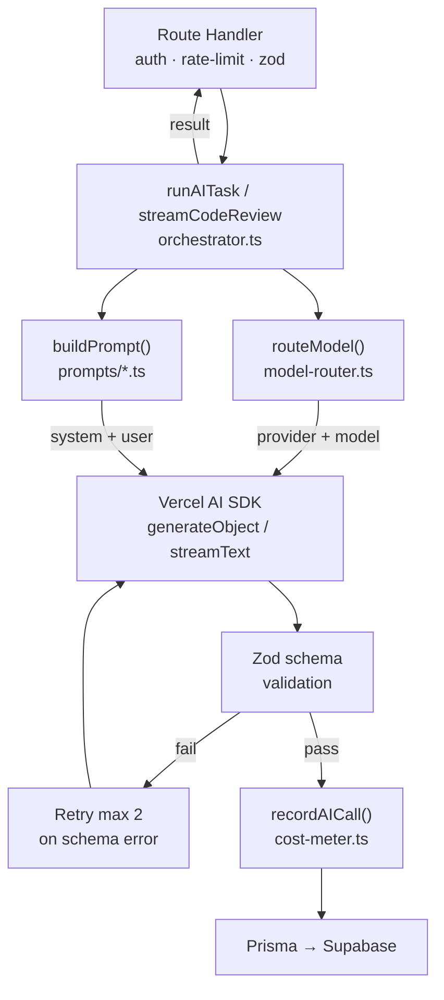

### Model Tiering

| Tier | Tasks | Typical Model |
|---|---|---|
| `cheap` | `generate_question`, `generate_followup`, `extract_jd` | DeepSeek Chat / Haiku |
| `smart` | `evaluate_answer`, `generate_summary`, `review_code`, `review_component` | DeepSeek Chat / Sonnet |

Provider selected via `LLM_SMART_PROVIDER` / `LLM_CHEAP_PROVIDER` → `LLM_PROVIDER` → `deepseek`.

### AI Task Registry

| Task | Input | Output | Tier |
|---|---|---|---|
| `generate_question` | topic, difficulty, CV/JD context | question + expectedPoints | cheap |
| `generate_followup` | question + answer | follow-up question | cheap |
| `evaluate_answer` | question + answer + rubric | 6-dimension scores + feedback | smart |
| `generate_summary` | all answers in session | overall score + action items | smart |
| `extract_jd` | raw job description | role, stack, signals | cheap |
| `review_code` | JS challenge + user code | streamed markdown | smart |
| `review_component` | JSX code + axe signals | streamed accessibility critique | smart |

CV parsing and review use separate privacy-conscious flows excluded from `AICall` telemetry.

---

## 7. Interview Session Lifecycle

### Standard / Deep Coaching Mode

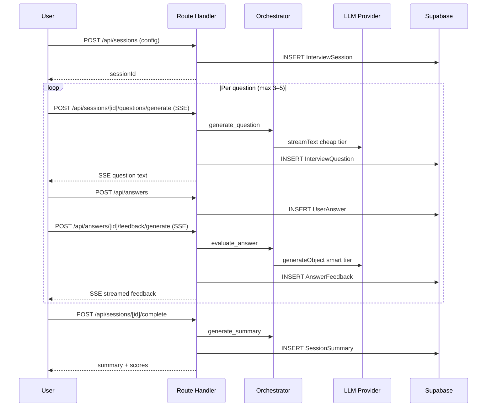

### Mock Exam Mode (no live feedback)

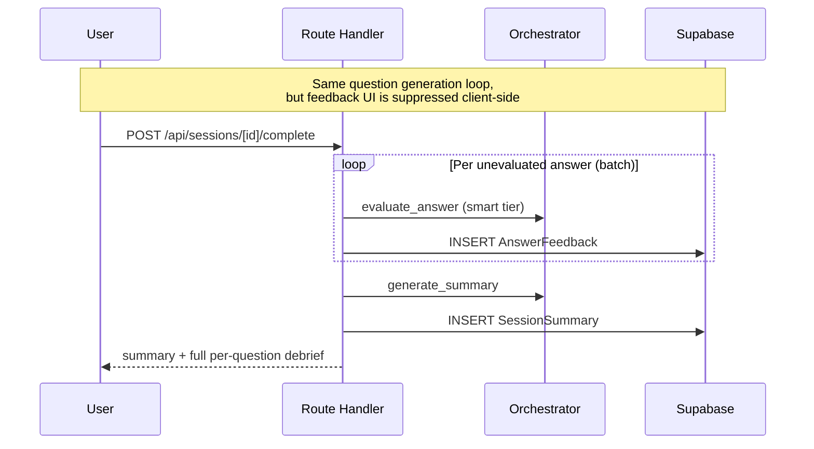

---

## 8. Coding Challenges Feature

Two challenge kinds with distinct execution paths.

### Function Challenges (`kind = "function"`)

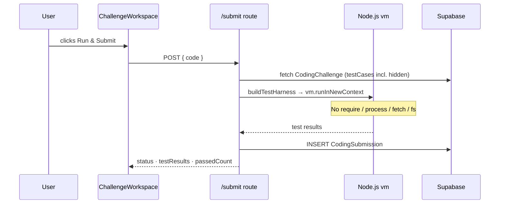

### Component Challenges (`kind = "component"`)

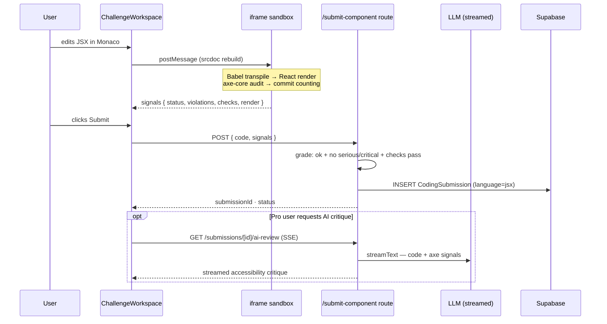

### Security Boundaries

| Concern | Mechanism |
|---|---|
| Authentication | `requireUser()` — 401 if no valid session |
| Rate limiting | `guardGeneralLimit()` — Upstash sliding window per user |
| JS sandbox | `vm.runInNewContext` — no `require`, `process`, `fetch`, `fs` |
| Execution timeout | `vm` `timeout` (sync) + `Promise.race` wall-clock (async) |
| Component sandbox | sandboxed `<iframe>` srcdoc — no access to parent origin |
| axe signals trust | Signals are user's own measurements — faking them harms no one but the submitter |
| Hidden test data | `solution` and hidden `expected` values never sent to client |
| AI review gate | Pro-only + `status === 'passed'` only |
| AI review cache | Persisted to `CodingSubmission.aiReview` — no repeat LLM calls |

---

## 9. Spaced Repetition (Daily Review)

Every scored interview answer advances the SM-2 state for its topic.

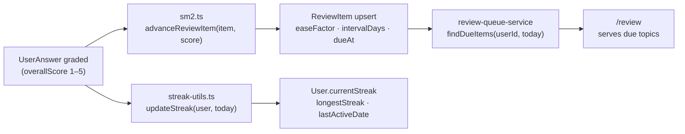

`ReviewItem` is keyed on `(userId, topic)` with a unique constraint. `dueAt` starts at `now()` and advances by `intervalDays` after each successful review. `easeFactor` is clamped between 1.3 and 2.5.

---

## 10. Authentication Flow

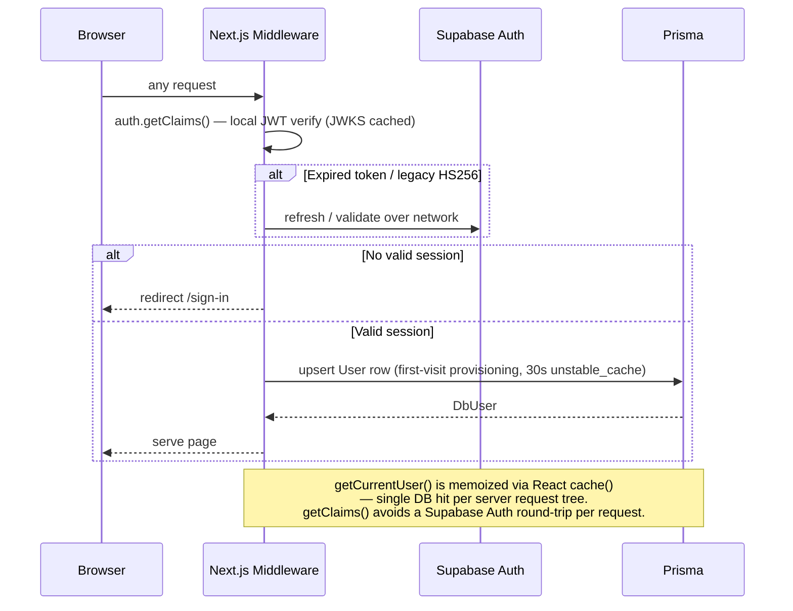

---

## 11. Share Result Flow

Session results can be shared via a public URL that requires no authentication.

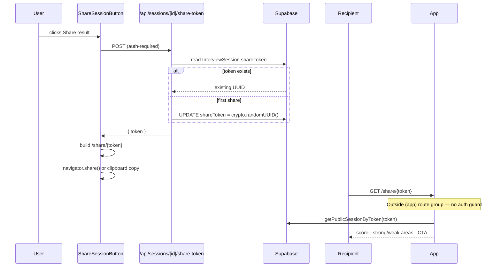

---

## 12. Subscription & Billing

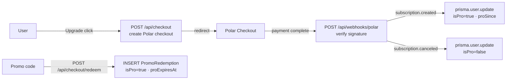

---

## 13. Feature Dependency Map

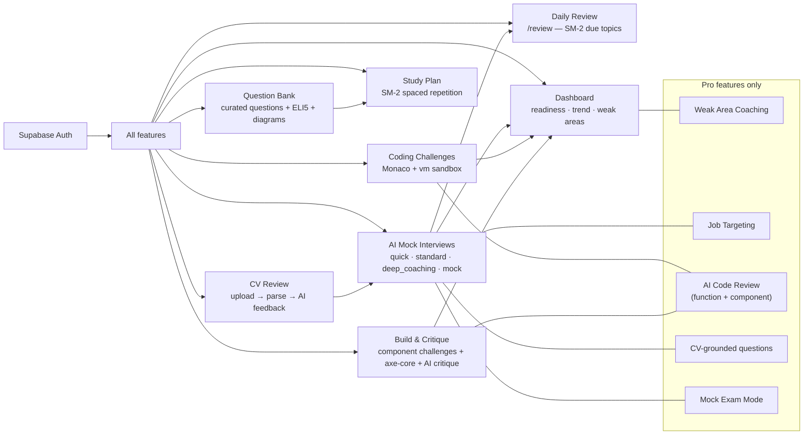

---

## 14. Public SEO Layer

The `(reader)` route group provides fully server-rendered public pages for organic acquisition. No auth required.

| Route | Purpose |
|---|---|
| `/questions` | All-topics hub — grid of topic cards with question counts |
| `/questions/[topic]` | Per-topic hub — questions list with difficulty filter |
| `/questions/[slug]` | Question detail — question text, ELI5, diagram, quiz (gated behind sign-up) |
| `/resources/**` | Handbooks (FSD, JS core, React, Optimization), cheatsheets, glossary |

Key constraints:
- `study-public-service.ts` never selects `rubric`, `expectedPoints`, or `followUps` — the answer key cannot reach anonymous HTML
- `SeedQuestion.slug` is assigned once on seed import and never regenerated (URL permanence)
- OG image at `/api/og/question?id=...` — used for social sharing and Twitter card
- `src/app/sitemap.ts` includes all question slugs; `robots.ts` allows crawling of `(reader)` paths

---

## 15. Folder Structure

```
src/
├── app/
│   ├── (marketing)/              # public: landing, demo, privacy, terms
│   ├── (reader)/                 # public SEO: question bank + resources
│   │   ├── questions/            # hub, [topic], [slug] detail
│   │   └── resources/            # handbooks + cheatsheets + glossary
│   ├── (app)/                    # auth + onboarding gated
│   │   ├── layout.tsx            # sidebar + header + auth/onboarding guard
│   │   ├── dashboard/
│   │   ├── practice/             # [new] setup; [sessionId] interview + complete
│   │   ├── review/               # daily spaced repetition
│   │   ├── coding-challenges/    # list + [id] workspace (fn + component)
│   │   ├── question-bank/
│   │   ├── study-plan/
│   │   ├── history/
│   │   ├── cv-review/
│   │   └── settings/ upgrade/
│   ├── share/[token]/            # public share page (no auth, no route group)
│   ├── sign-in/
│   └── api/
│       ├── sessions/             # CRUD + question SSE + complete + share-token
│       ├── answers/              # submit + feedback SSE + followup SSE
│       ├── coding-challenges/    # list · single · submit · submit-component
│       │                         # solution · ai-review (SSE)
│       ├── dashboard/            # aggregated stats
│       ├── study-plan/           # SM-2 progress + tailor-to-job
│       ├── target-jobs/          # Pro JD targeting CRUD
│       ├── transcribe/           # browser audio → text (voice input)
│       ├── cv/                   # upload · parse · review
│       ├── checkout/             # Polar billing
│       ├── revalidate/           # cache busting (seed script webhook)
│       ├── og/                   # OG image generators (session + question)
│       └── webhooks/polar/
│
├── features/                     # vertical slices, max ~200 LoC per file
│   ├── interview/                # session UI, hooks, Zustand store, AI schemas
│   ├── feedback/                 # feedback card, streaming hook, share button
│   │   └── server/               # summary-service, share-service
│   ├── coding-challenges/        # workspace, editor, test results, hints, solution
│   │   └── component-sandbox/    # iframe srcdoc builder, axe signals, a11y panel
│   ├── review/                   # SM-2 algorithm, streak utils, review queue
│   ├── dashboard/                # charts, readiness card, recommendations
│   ├── study/                    # question card, filter bar, prose renderer
│   ├── study-plan/               # plan management
│   ├── target-jobs/              # job description management
│   ├── cv-review/                # CV upload + review card
│   ├── settings/                 # profile, preferences, interview date
│   ├── subscription/             # promo code, upgrade prompts
│   └── app/                      # sidebar nav, app header
│
├── lib/                          # shared, feature-agnostic utilities
│   ├── ai/
│   │   ├── orchestrator.ts       # runAITask · streamCodeReview
│   │   ├── model-router.ts       # cheap vs smart tiering
│   │   ├── cost-meter.ts         # AICall telemetry
│   │   └── prompts/              # one file per AI task
│   ├── coding-challenges/
│   │   ├── local-js-executor.ts  # vm sandbox with async/await support
│   │   ├── test-harness-builder.ts
│   │   ├── submission-validator.ts
│   │   └── challenge-projection.ts
│   ├── auth/
│   │   ├── session.ts            # getCurrentUser · requireUser
│   │   └── supabase-*.ts         # SSR/browser clients
│   ├── db/client.ts              # Prisma singleton with pg adapter
│   ├── rate-limit/               # Upstash guard helpers
│   ├── seo/                      # site-url · slugify-question · structured-data
│   └── subscription/             # isPro checks
│
├── components/ui/                # shadcn primitives
└── prisma/
    ├── schema.prisma             # 16 models
    └── seeds/
        ├── seed.ts               # SeedQuestion seeder
        └── coding-challenges-seed.ts
```

**Import rule:** `features/*` may import from `lib/*` and `components/*`. `lib/*` must never import from `features/*`.

---

## 16. Key Design Decisions

| Decision | Rationale |
|---|---|
| Single Vercel deploy | No microservices overhead for MVP scale |
| `vm.runInNewContext` instead of Piston API | Piston went whitelist-only Feb 2026; local sandbox is faster, zero cost, no external dependency |
| Async IIFE harness for code execution | Lets test cases `await` Promise-returning solutions without worker threads |
| iframe srcdoc for component sandbox | Isolates user JSX from parent origin; Babel CDN transpiles JSX client-side with no server round-trip |
| axe-core runs client-side | Server can't render React DOM; client signals are self-reported — faking harms only the submitter |
| Mock mode defers all feedback | Simulates a real exam environment; batch-generates at `/complete` so the payoff is revealed together |
| `InterviewSession.shareToken` lazy-generated | UUID created on first share click, not at session completion — avoids DB writes for sessions never shared |
| `/share/[token]` at root (not in `(app)`) | Outside the auth-guarded route group; accessible to anyone with the link |
| AI review cached per submission | Persists to `CodingSubmission.aiReview`; no redundant LLM calls on revisits |
| `getCurrentUser()` uses React `cache()` | One DB round-trip per request tree regardless of how many server components call it |
| Zod validation at AI output boundary | LLM JSON is untrusted — validate before persisting; schema mismatch triggers one retry |
| `cheap` / `smart` model tiers | Balances cost vs quality: question gen is high-volume (cheap); evaluation is quality-critical (smart) |
| Public SEO question bank (`/questions/**`) | Organic acquisition; free preview (question + ELI5 + diagram) fully server-rendered; quiz/AI practice gated behind sign-up. `study-public-service.ts` never selects answer keys |
| `SeedQuestion.slug` assigned once | Never regenerated when question text is edited — URL permanence beats slug freshness |
| SM-2 on `ReviewItem` (not `StudyPlanProgress`) | Interview sessions advance spaced repetition state independently of the study plan; `/review` surfaces any due topic |
| Recharts + Mermaid lazy-loaded | Both are large; dynamic import with `ssr: false` keeps the main bundle lean |
