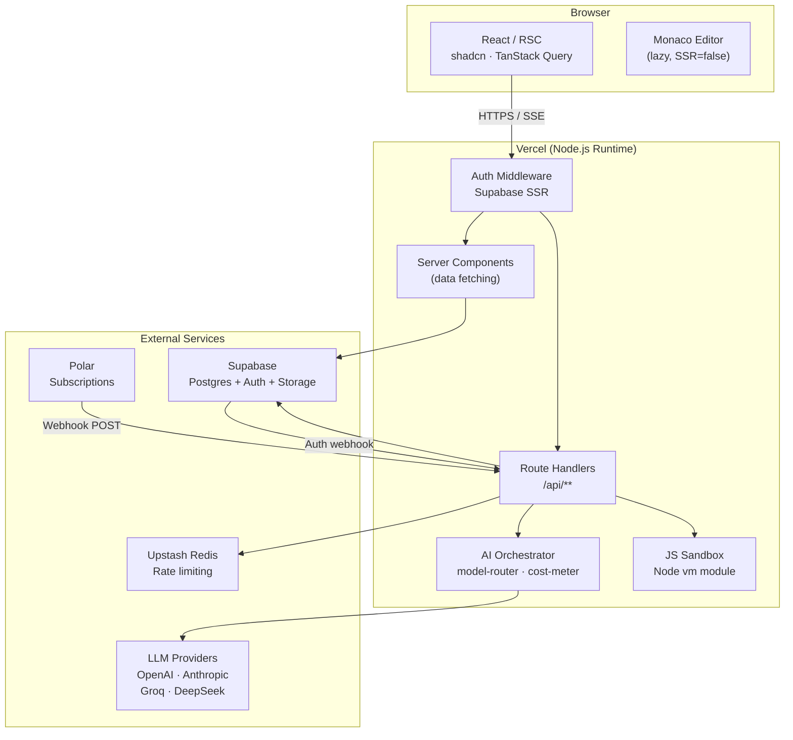
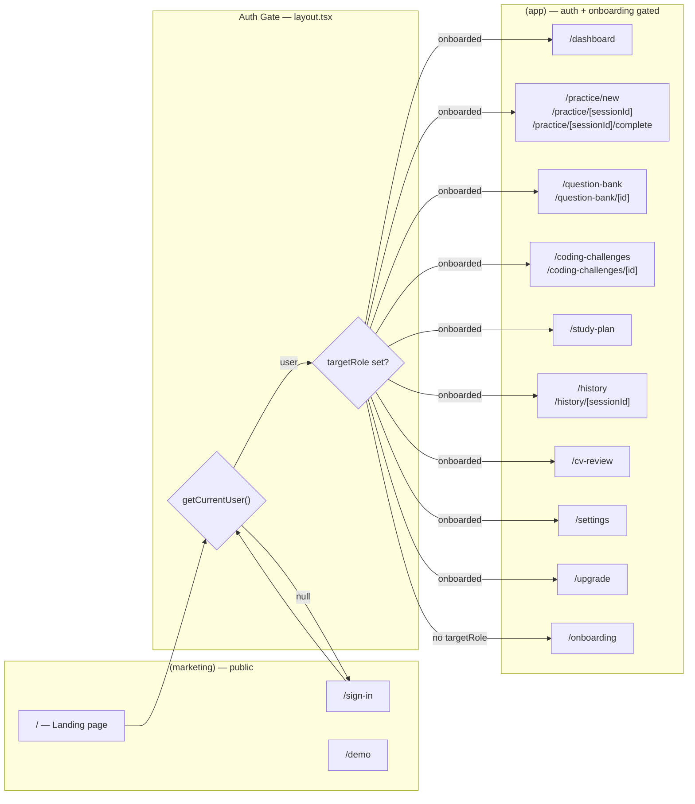
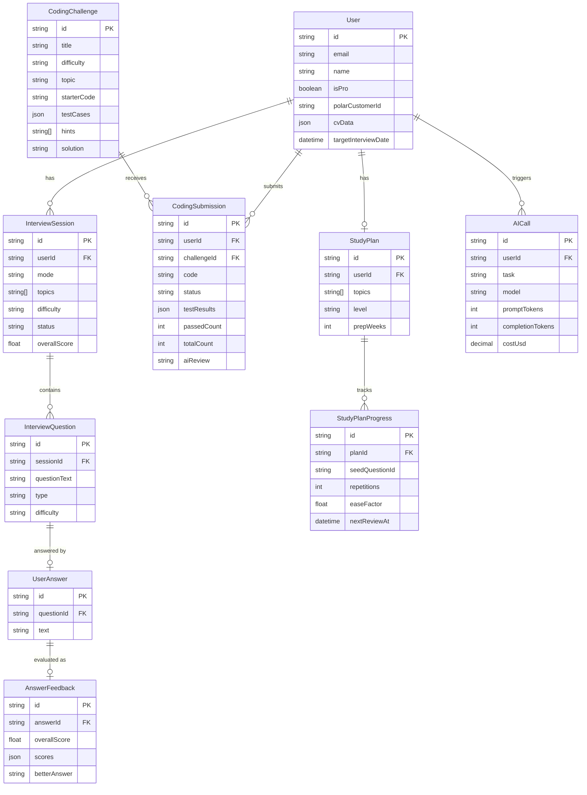
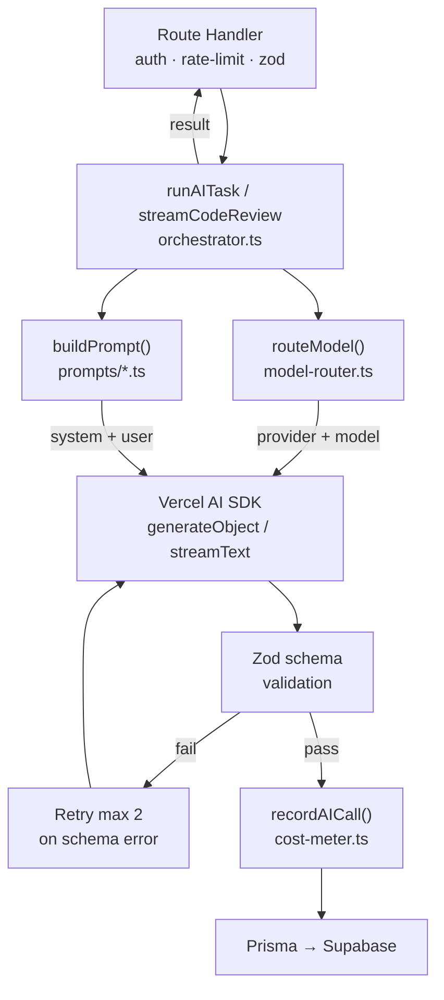
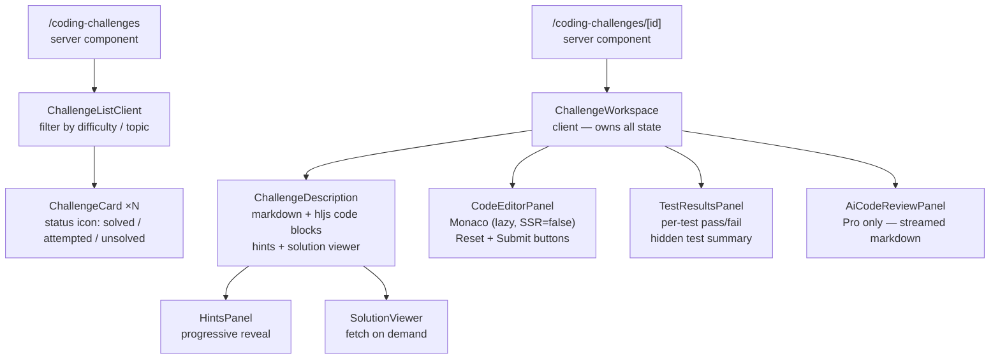
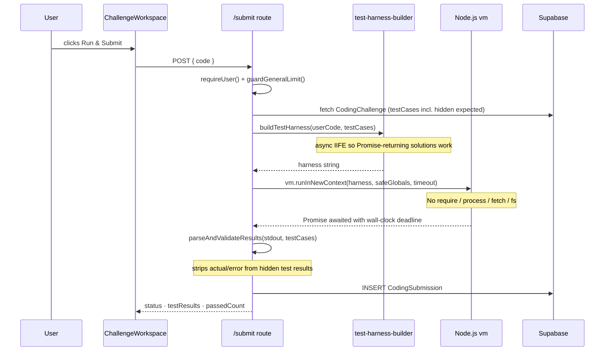
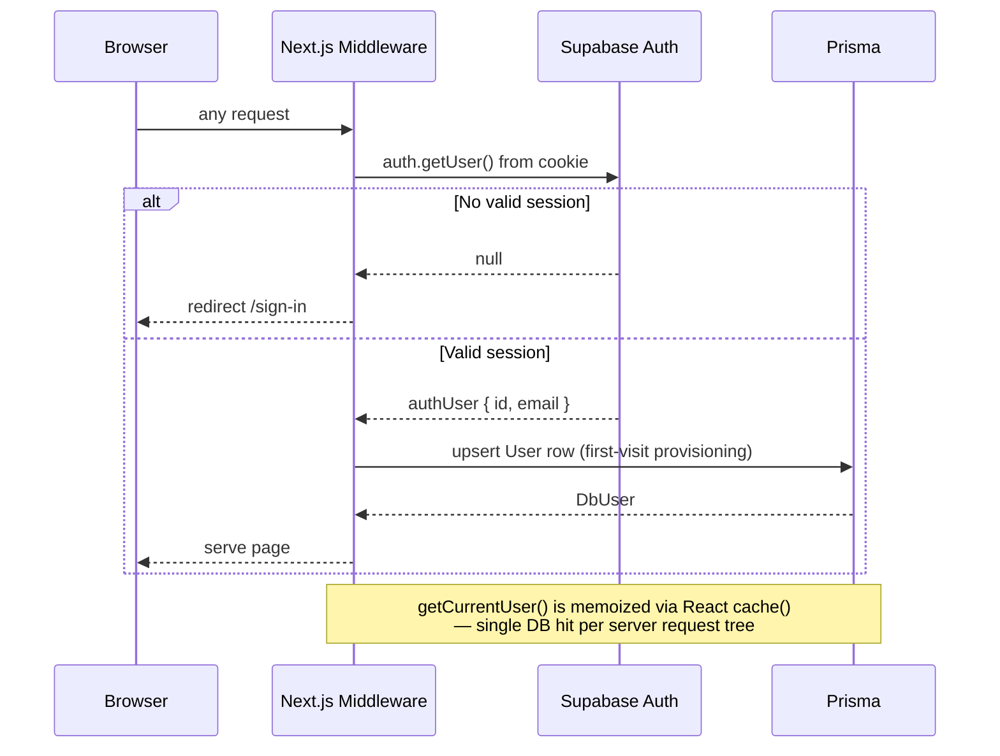
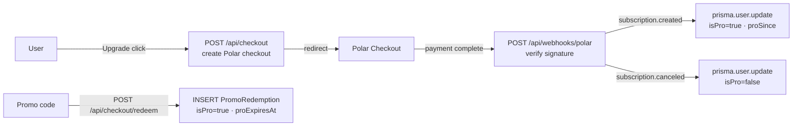
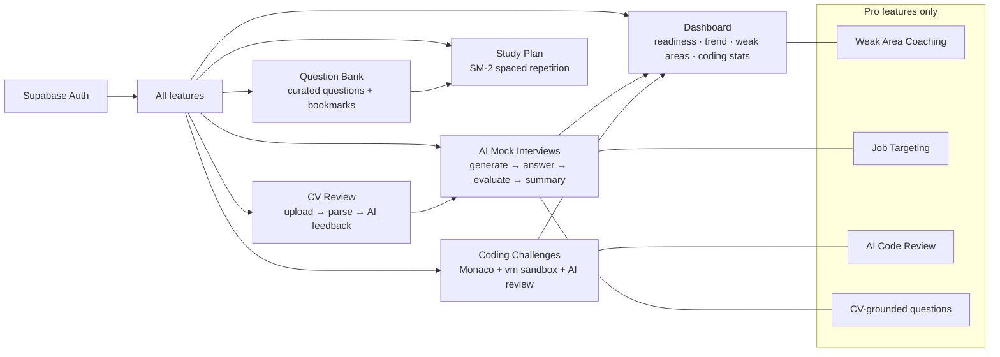

# System Architecture — Frontend Coach

**Status:** v2 (current)
**Last updated:** 2026-06-08

---

## 1. Overview

Frontend Coach is a Next.js 16 App Router application that helps developers prepare for frontend engineering interviews through three complementary practice modes:

1. **AI Mock Interviews** — adaptive question generation, follow-up probing, and rubric-grounded scoring
2. **Question Bank + Study Plan** — browsable curated questions with spaced-repetition scheduling
3. **Coding Challenges** — Monaco editor + sandboxed JS execution + AI code review

The entire app deploys as a single Vercel unit backed by Supabase Postgres.

---

## 2. Tech Stack

| Layer | Technology | Notes |
|---|---|---|
| Framework | Next.js 16 (App Router) | RSC streaming, SSE built-in, Turbopack |
| Language | TypeScript (strict) | Zod schemas shared between API and AI contracts |
| Styling | Tailwind v4 + shadcn/ui | CSS variables for light/dark theming |
| AI SDK | Vercel AI SDK v6 | `generateObject` (Zod-validated) + `streamText` |
| LLM Providers | OpenAI, Anthropic, Groq, DeepSeek | Tier-routed via env vars |
| ORM | Prisma 7 | Supabase Postgres with pg adapter |
| Auth | Supabase Auth (`@supabase/ssr`) | Email + Google OAuth; SSR-safe cookie session |
| Rate Limiting | Upstash Redis | Per-user sliding window |
| Payments | Polar | Subscription webhooks |
| Server Cache | TanStack Query v5 | Client-side query cache + optimistic updates |
| Code Execution | Node.js `vm` module | Sandboxed JS harness for coding challenges |
| Code Editor | Monaco (`@monaco-editor/react`) | Lazy-loaded, SSR-disabled |
| Syntax Highlight | highlight.js + js-beautify | Challenge descriptions and test case rendering |
| Hosting | Vercel | Streaming responses, edge middleware |

---

## 3. High-Level Architecture



---

## 4. Application Routing



---

## 5. Data Model



---

## 6. AI Orchestration Layer

Every LLM call routes through a single orchestrator in `src/lib/ai/orchestrator.ts`. Route handlers stay thin — they authenticate, validate, then delegate.



### Model Tiering

| Tier | Tasks | Typical Model |
|---|---|---|
| `cheap` | `generate_question`, `generate_followup`, `extract_jd` | DeepSeek Chat / Haiku |
| `smart` | `evaluate_answer`, `generate_summary`, `review_code` | DeepSeek Chat / Sonnet |

Provider selected via env vars `LLM_SMART_PROVIDER` / `LLM_CHEAP_PROVIDER`, falling back to `LLM_PROVIDER`, then `deepseek`.

### AI Task Registry

| Task | Input | Output | Tier |
|---|---|---|---|
| `generate_question` | topic, difficulty, CV/JD context | question + expectedPoints | cheap |
| `generate_followup` | question + answer | follow-up question | cheap |
| `evaluate_answer` | question + answer + rubric | 6-dimension scores + feedback | smart |
| `generate_summary` | all answers in session | overall score + action items | smart |
| `extract_jd` | raw job description | role, stack, signals | cheap |
| `review_code` | challenge + user code | streamed markdown (no schema) | smart |

---

## 7. Interview Session Lifecycle

```mermaid
sequenceDiagram
    participant U as User
    participant RSC as Server Component
    participant API as Route Handler
    participant Orch as Orchestrator
    participant LLM as LLM Provider
    participant DB as Supabase

    U->>RSC: /practice/new (topic + difficulty)
    RSC->>API: POST /api/sessions
    API->>DB: INSERT InterviewSession
    API-->>U: sessionId

    loop Per question (max 5)
        U->>API: POST /api/sessions/[id]/questions/generate (SSE)
        API->>Orch: generate_question
        Orch->>LLM: streamText cheap tier
        LLM-->>Orch: QuestionOutput
        API->>DB: INSERT InterviewQuestion
        API-->>U: SSE question text

        U->>API: POST /api/answers
        API->>DB: INSERT UserAnswer
        API-->>U: answerId

        U->>API: POST /api/answers/[id]/feedback/generate (SSE)
        API->>Orch: evaluate_answer
        Orch->>LLM: generateObject smart tier
        LLM-->>Orch: EvaluateOutput
        API->>DB: INSERT AnswerFeedback
        API-->>U: SSE streamed feedback
    end

    U->>API: POST /api/sessions/[id]/complete
    API->>Orch: generate_summary
    Orch->>LLM: generateObject smart tier
    API->>DB: INSERT SessionSummary
    API-->>U: summary + scores
```



---

## 8. Coding Challenges Feature

### Component Tree



### Code Execution Flow



### Security Boundaries

| Concern | Mechanism |
|---|---|
| Authentication | `requireUser()` — 401 if no valid session |
| Rate limiting | `guardGeneralLimit()` — Upstash sliding window per user |
| Code sandbox | `vm.runInNewContext` — no `require`, `process`, `fetch`, `fs` globals |
| Execution timeout | `vm` `timeout` option (sync) + `Promise.race` wall-clock (async) |
| Hidden test data | `solution` and hidden `expected` values never sent to client |
| AI review gate | Pro-only + `status === 'passed'` submissions only |
| AI review cache | Persisted to `CodingSubmission.aiReview` — no repeat LLM calls |

---

## 9. Authentication Flow



---

## 10. Subscription & Billing



---

## 11. Feature Dependency Map



---

## 12. Folder Structure

```
src/
├── app/
│   ├── (marketing)/              # public: landing, sign-in, demo
│   ├── (app)/                    # auth + onboarding gated
│   │   ├── layout.tsx            # sidebar + header + auth/onboarding guard
│   │   ├── dashboard/
│   │   ├── practice/             # [new] session setup; [sessionId] interview
│   │   ├── coding-challenges/    # list + [id] workspace
│   │   ├── question-bank/
│   │   ├── study-plan/
│   │   ├── history/
│   │   ├── cv-review/
│   │   └── settings/ upgrade/
│   └── api/
│       ├── sessions/             # interview session CRUD + question SSE
│       ├── answers/              # submit + feedback SSE
│       ├── coding-challenges/    # list · single · submit · solution · ai-review
│       ├── dashboard/            # aggregated stats
│       ├── study-plan/           # SM-2 progress tracking
│       ├── cv/                   # upload · parse · review
│       ├── checkout/             # Polar billing
│       └── webhooks/             # Polar + Supabase auth lifecycle
│
├── features/                     # vertical slices, max ~200 LoC per file
│   ├── interview/                # session UI, hooks, Zustand store, AI schemas
│   ├── feedback/                 # feedback card, streaming hook
│   ├── coding-challenges/        # workspace, editor, test results, hints, solution
│   ├── dashboard/                # charts, stats, recommendations, coding stat card
│   ├── study/                    # question card, filter bar, prose renderer
│   ├── study-plan/               # plan management
│   ├── cv-review/                # CV upload + review card
│   ├── settings/                 # profile, preferences
│   ├── subscription/             # promo code, upgrade prompts
│   └── app/                      # sidebar nav, app header
│
├── lib/                          # shared, feature-agnostic utilities
│   ├── ai/
│   │   ├── orchestrator.ts       # runAITask · streamCodeReview
│   │   ├── model-router.ts       # cheap vs smart tiering
│   │   ├── cost-meter.ts         # AICall telemetry
│   │   └── prompts/              # one file per AI task
│   ├── coding-challenges/
│   │   ├── local-js-executor.ts  # vm sandbox with async await support
│   │   ├── test-harness-builder.ts # async IIFE test harness
│   │   ├── submission-validator.ts # stdout parse + hidden strip
│   │   └── challenge-projection.ts # safe public shape (no solution)
│   ├── auth/
│   │   ├── session.ts            # getCurrentUser · requireUser
│   │   └── supabase-*.ts         # SSR/browser Supabase clients
│   ├── db/client.ts              # Prisma singleton with pg adapter
│   ├── rate-limit/               # Upstash guard helpers
│   └── subscription/             # isPro checks
│
├── components/ui/                # shadcn primitives
└── prisma/
    ├── schema.prisma             # 15 models
    └── seeds/
        ├── seed.ts               # SeedQuestion seeder (JSON → DB)
        └── coding-challenges-seed.ts  # 30 JS challenges with hints
```

**Import rule:** `features/*` may import from `lib/*` and `components/*`. `lib/*` must never import from `features/*`.

---

## 13. Key Design Decisions

| Decision | Rationale |
|---|---|
| Single Vercel deploy | No microservices overhead for MVP scale |
| `vm.runInNewContext` instead of Piston API | Piston went whitelist-only Feb 2026; local sandbox is faster, zero cost, no external dependency |
| Async IIFE harness for code execution | Lets test cases `await` Promise-returning solutions (debounce, retry) without needing worker threads |
| AI review cached per submission | Persists to `CodingSubmission.aiReview`; no redundant LLM calls on revisits |
| `getCurrentUser()` uses React `cache()` | One DB round-trip per request tree regardless of how many server components call it |
| Zod validation at AI output boundary | LLM JSON is untrusted — validate before persisting. Schema mismatch triggers one retry |
| `cheap` / `smart` model tiers | Balances cost vs quality: question gen is high-volume (cheap); evaluation is quality-critical (smart) |
| Visible test cases expose `expected` | Helps users understand the assertion. Hidden cases keep `expected` server-only to prevent gaming |
| Progressive hints + gated solution | Encourages genuine problem-solving; friction (confirmation dialog) before solution reveal |
